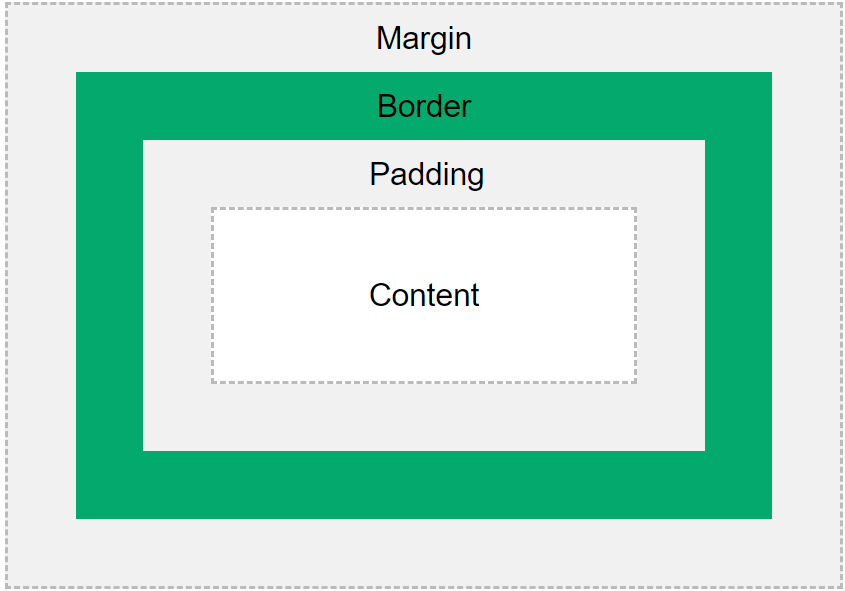

#  LEARN CSS BOX MODEL
## Table of Contents

1. [Box Model](#box-model)
2. [margin](#margin)
3. [Border](#border)
4. [padding](#padding)
5. [content area](#content-area)

## Box model
In CSS, the term "box model" is used when talking about design and layout.

The CSS box model is essentially a box that wraps around every HTML element. It consists of: content, padding, borders and margins. The image below illustrates the box model:



Explanation of difrent parts:

- **Margin** - [Margin](https://www.geeksforgeeks.org/css-margins-padding/) clears an area outside the border. The margin is transparent

- **Border** - A [border](https://www.geeksforgeeks.org/css-borders/) that goes around the padding and content

- **content** - The [content](https://www.geeksforgeeks.org/css-box-model/) of the box, where text and images appear

- **Padding** - [Padding](https://www.geeksforgeeks.org/css-margins-padding/) clears an area around the content. The padding is transparent


## Margin
- Separates the element from adjacent elements.
- Dimensions specified by the margin-box width and height.
```
   <style>
        p {
            margin: 80px 100px 50px 80px;
        }
    </style>
```
## Border
- Lies between the padding and margin.

- Width and height are defined by the border
```css
.content {
  border: 5px solid black;
}
```

## Padding
- Surrounds the content area.
- Space within the border box.
- Dimensions are determined by the width and height of the padding box.
 ```css
    <style>
        p {
            margin: 80px 100px 50px 80px;
        }
    </style>
 ```


## Content Area
- Contains the actual data, such as text, images, or other media.
- Sized using the width and height properties.
- Bounded by the content edge.

```css
.content {
  content: "Hello World";
}
```
## Conclusion 


The CSS box model defines how elements are structured and spaced in web design, comprising content, padding, border, and margin. Understanding and manipulating these components enables designers to create visually appealing and well-structured layouts for websites.
## Read More 
- [CSS Box Model ](https://www.javatpoint.com/css-box-model)
- [w3schools css box model](https://www.w3schools.com/css/css_boxmodel.asp)